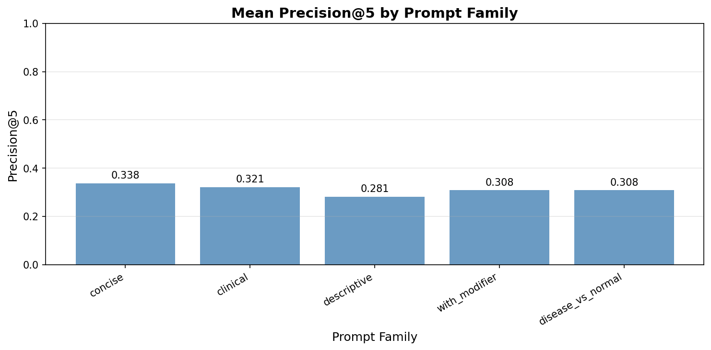

# CLIP-based Biomedical Image Retrieval with PathMNIST

This project demonstrates **text-to-image and image-to-image retrieval** using **CLIP models** on the **PathMNIST histology dataset**. It also explores **prompt sensitivity** — how different ways of phrasing text queries affect retrieval performance.

## Features

1. **Text-to-Image Search**  
   Search for relevant histology images using natural language prompts.  
   Example: `"colorectal adenocarcinoma"` → returns top similar images.  

2. **Image-to-Image Search**  
   Find images visually similar to a query image.  

3. **Prompt Sensitivity Analysis**  
   Compare different prompt styles (concise, clinical, descriptive, etc.) to see how phrasing affects retrieval.  

4. **Evaluation Metrics**  
   - **Precision@K**: fraction of retrieved images that match the correct class.  
   - **Kendall’s tau**: consistency of rankings between different prompt phrasings.

---

## Dataset

- **PathMNIST**: 9-class histology dataset of colon tissue.
- Sample classes: adipose, background, lymphocytes, colorectal adenocarcinoma, etc.
- Images are loaded as 28x28 RGB arrays and converted to PIL images.

---

## Prompt Families

Prompts are grouped into **five main families**:

| Family              | Description                                        | Mean Precision@5 |
|--------------------|--------------------------------------------------|----------------|
| concise             | Single label (e.g., `"adipose"`)                 | 0.338          |
| clinical            | Medical-style description (e.g., `"Histology: adipose"`) | 0.321          |
| descriptive         | Detailed description with staining info          | 0.281          |
| with_modifier       | Labels with modifiers (e.g., `"adipose -- tumor region"`) | 0.308          |
| disease_vs_normal   | Phrases like `"normal adipose"` or `"tumor adipose"` | 0.308          |

**Interpretation:**  
- **Higher mean Precision@5** indicates the prompts retrieve more relevant images in the top 5 results.  
- In this experiment, **concise prompts slightly outperform others**, but differences are generally small.  
- This suggests that even simple prompts are effective with CLIP models for histology retrieval.

---
**How to run:**  
For image or text query use Clip.ipynb from google collab or your code editor.
For prompt evaluation experimentation, use clip_promptE.ipynb

**Note:**
- Using larger CLIP models (e.g., ViT-L-14) improves retrieval performance but requires high GPU memory and may take a long time on free Google Colab.

= This setup uses clip-ViT-B-32 for a balance between speed and accuracy.
